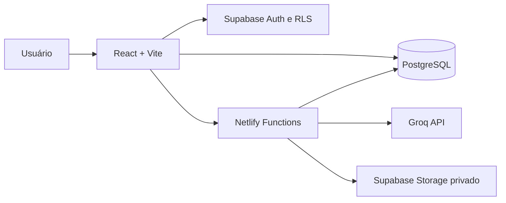

<div align="center">


# Weber Financeiro

### Finanças pessoais rápidas, visuais e assistidas por IA

Organize contas, cartões, dívidas e fluxo de caixa sem depender de Open Finance.

[](https://react.dev/)
[](https://www.typescriptlang.org/)
[](https://supabase.com/)
[](https://www.netlify.com/)
[](https://groq.com/)

</div>

---

## Identidade visual

Os arquivos da marca estão disponíveis em [`public/brand`](public/brand):

- [`logos.png`](logos.png): prancha original preservada no repositório;
- `weber-financeiro-dark.png`: assinatura horizontal transparente para fundos claros;
- `weber-financeiro-light.png`: assinatura horizontal transparente para fundos escuros;
- `weber-symbol.png`: símbolo transparente sem texto;
- `weber-symbol-square.png`: símbolo em tela quadrada para favicon e atalhos;
- `original-*.png`: quatro recortes sem redimensionamento da prancha original.

Os recortes `original-*` preservam os pixels e a resolução da imagem fornecida, sem compressão com perdas.

## Sobre o projeto

O Weber Financeiro é uma aplicação web responsiva para quem precisa entender rapidamente:

- quanto dinheiro possui agora;
- quanto ainda sobra até o fim do mês;
- quais contas e faturas estão próximas do vencimento;
- onde está gastando mais;
- quanto deve e qual dívida deveria priorizar.

O projeto funciona no navegador, com uma experiência resumida no celular e uma visão financeira ampla no desktop. A moeda padrão é BRL, o idioma é `pt-BR` e o fuso utilizado é `America/Bahia`.

## Principais recursos

### Visão financeira

- Saldo atual calculado a partir dos saldos iniciais e movimentações pagas.
- Saldo projetado com receitas e despesas pendentes.
- Fluxo de caixa com entradas, saídas e evolução do saldo.
- Despesas por categoria.
- Próximos vencimentos.
- Fatura e limite disponível dos cartões.
- Orçamentos mensais por categoria.
- Saldo consolidado das dívidas.

### Lançamentos rápidos

- Registro manual com apenas descrição e valor.
- Receita ou despesa com padrões inteligentes.
- Campos avançados recolhidos em **Mais opções**.
- Lançamentos únicos, recorrentes ou parcelados.
- Compras no cartão vinculadas à fatura correta.
- Ajuste rápido do saldo para conferência com o aplicativo do banco.
- Edição e exclusão de transações.

### Weber IA

- Perguntas baseadas somente nos dados autorizados do usuário.
- Criação de rascunhos por texto.
- Transcrição de lançamentos por áudio.
- Extração de comprovantes por imagem.
- Recuperação contextual de contas, cartões, categorias, orçamentos, dívidas e transações.
- Seleção da transação correta quando existem resultados semelhantes.
- Edição sempre confirmada em formulário.
- Exclusão protegida por nova validação da senha.
- Instruções personalizadas configuráveis pelo usuário.

### Relatórios

- PDF visual.
- CSV detalhado em UTF-8.
- Excel com abas, filtros e valores numéricos.
- Filtros e consolidação pelo mês selecionado.

## Tecnologias

| Camada | Tecnologias |
| --- | --- |
| Interface | React 19, TypeScript, Vite |
| Estilos | Tailwind CSS 4 e CSS responsivo |
| Gráficos | Recharts |
| Backend | Supabase Auth, PostgreSQL, RLS e Storage |
| Serverless | Netlify Functions |
| IA | Groq Compound, Qwen Vision e Whisper |
| Validação | Zod |
| Relatórios | jsPDF, fflate e XLSX gerado no navegador |
| Testes | Vitest |

## Arquitetura



As chaves públicas do Supabase podem ser utilizadas pelo navegador. A `service_role` e a chave da Groq ficam exclusivamente nas Netlify Functions.

## Executar localmente

### Requisitos

- Node.js 20 ou superior.
- Um projeto Supabase.
- Uma chave da Groq.
- Netlify CLI, executado via `npx`.

### 1. Instale as dependências

```bash
npm install
```

### 2. Configure o ambiente

Copie `.env.example` para `.env`:

```bash
cp .env.example .env
```

No PowerShell:

```powershell
Copy-Item .env.example .env
```

Preencha:

```env
VITE_SUPABASE_URL=
VITE_SUPABASE_ANON_KEY=

SUPABASE_URL=
SUPABASE_SERVICE_ROLE_KEY=

GROQ_API_KEY=
GROQ_CHAT_MODEL=groq/compound
GROQ_VISION_MODEL=qwen/qwen3.6-27b
GROQ_TRANSCRIBE_MODEL=whisper-large-v3-turbo
```

Nunca envie o arquivo `.env` para o Git.

### 3. Prepare o Supabase

1. Crie um projeto no [Supabase](https://supabase.com/).
2. Abra o SQL Editor.
3. Execute [`supabase/migrations/202607290001_initial_schema.sql`](supabase/migrations/202607290001_initial_schema.sql).
4. Em **Authentication**, habilite login por e-mail e senha.
5. Configure as URLs permitidas de redirecionamento.

A migração cria:

- tabelas financeiras;
- índices;
- categorias iniciais;
- conta principal automática;
- Row Level Security;
- políticas de isolamento por usuário;
- bucket privado para comprovantes.

### 4. Inicie com Netlify Dev

Use este comando para executar frontend e funções serverless juntos:

```bash
npx netlify dev
```

Abra:

```text
http://localhost:8888
```

> Para testar a Weber IA localmente, use `netlify dev`. O comando `npm run dev` inicia apenas o Vite e é indicado para trabalhar exclusivamente na interface.

## Deploy no Netlify

O Netlify é o ambiente de hospedagem recomendado para este projeto. O arquivo [`netlify.toml`](netlify.toml) já configura:

- comando de build;
- diretório publicado;
- pasta das Functions;
- fallback de rotas da SPA;
- proxy local das APIs;
- portas utilizadas pelo ambiente de desenvolvimento.

### Deploy conectado ao Git

1. Envie o projeto para GitHub, GitLab ou Bitbucket.
2. No [Netlify](https://app.netlify.com/), escolha **Add new site → Import an existing project**.
3. Conecte o repositório.
4. Confirme:

```text
Build command: npm run build
Publish directory: dist
Functions directory: netlify/functions
```

5. Em **Site configuration → Environment variables**, adicione todas as variáveis listadas em `.env.example`.
6. Execute o primeiro deploy.

### Variáveis no Netlify

| Variável | Escopo | Observação |
| --- | --- | --- |
| `VITE_SUPABASE_URL` | Build/frontend | URL pública do Supabase |
| `VITE_SUPABASE_ANON_KEY` | Build/frontend | Chave pública protegida por RLS |
| `SUPABASE_URL` | Functions | URL utilizada no servidor |
| `SUPABASE_SERVICE_ROLE_KEY` | Functions | Nunca expor no frontend |
| `GROQ_API_KEY` | Functions | Chave privada da Groq |
| `GROQ_CHAT_MODEL` | Functions | Padrão: `groq/compound` |
| `GROQ_VISION_MODEL` | Functions | Modelo para comprovantes |
| `GROQ_TRANSCRIBE_MODEL` | Functions | Modelo para áudio |

Depois de alterar uma variável, gere um novo deploy.

### Configuração do Supabase para produção

Após o Netlify fornecer a URL do site:

1. Abra **Supabase → Authentication → URL Configuration**.
2. Defina a URL do Netlify como **Site URL**.
3. Adicione a URL do site e URLs de deploy preview em **Redirect URLs**.

Sem essa etapa, confirmação de e-mail e recuperação de senha podem redirecionar para o endereço errado.

## Scripts

```bash
npm run dev       # Vite sem Functions
npm run build     # TypeScript + build de produção
npm run preview   # Prévia do build
npm test          # Testes automatizados
npm run test:watch
```

## Segurança

- Todas as tabelas financeiras utilizam RLS.
- Cada consulta é limitada ao usuário autenticado.
- Comprovantes ficam em bucket privado.
- Áudios não são armazenados após a transcrição.
- A IA nunca recebe acesso direto para executar SQL.
- Novos lançamentos gerados pela IA são rascunhos.
- Exclusões exigem escolha explícita e validação de senha.
- Chaves privilegiadas nunca são incluídas no bundle do navegador.

## Limitações atuais

- Sem Open Finance ou sincronização bancária.
- Sem importação OFX/CSV de extratos.
- Sem notificações push ou e-mail.
- Sem modo offline ou PWA.
- Sem compartilhamento familiar.

O botão **Ajustar saldo** ajuda a reconciliar rapidamente as contas quando algum lançamento não foi registrado.

## Contribuindo

Contribuições são bem-vindas:

1. Crie um fork.
2. Abra uma branch descritiva.
3. Execute `npm test` e `npm run build`.
4. Abra um Pull Request explicando a motivação da mudança.

Evite incluir credenciais, extratos, comprovantes ou outros dados financeiros reais em issues, commits e testes.

---

<div align="center">

Feito para tornar o controle financeiro pessoal mais simples, rápido e visual.

</div>
