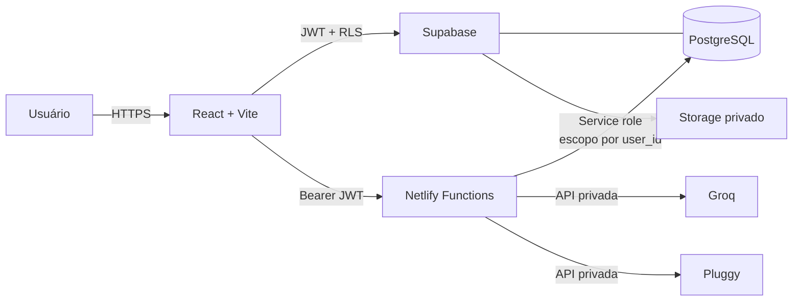

<div align="center">


# Weber Financeiro

**Controle financeiro pessoal rápido, visual e orientado a decisões.**

Contas, cartões, transações, dívidas, metas, patrimônio, Open Finance pessoal e assistência por IA em uma única aplicação responsiva.

[](https://react.dev/)
[](https://www.typescriptlang.org/)
[](https://supabase.com/)
[](https://www.netlify.com/)
[](https://vitest.dev/)

</div>

---

## Visão geral

O Weber Financeiro foi criado para responder rapidamente às perguntas que realmente importam:

- Quanto dinheiro tenho agora?
- Quanto posso gastar sem comprometer minhas contas?
- O que vence nos próximos dias?
- Onde estou gastando mais?
- Como estão minhas dívidas, reserva e patrimônio?
- Minha vida financeira está melhorando?

A aplicação prioriza leitura rápida, linguagem simples e decisões práticas. No desktop, aproveita o espaço para consolidar indicadores e gráficos. No celular, reorganiza o conteúdo em cartões, navegação inferior e fluxos curtos.

> Projeto pessoal. Não substitui orientação financeira, contábil ou de investimento profissional.

## Recursos

### Gestão diária

- Saldo atual e projetado.
- Dinheiro livre até a próxima renda.
- Limite semanal sugerido.
- Receitas e despesas realizadas ou pendentes.
- Calendário financeiro e próximos vencimentos.
- Alertas de atraso, saldo insuficiente, orçamento e limite de cartão.
- Filtro por mês ou intervalo personalizado.
- Privacidade para ocultar valores na tela.

### Planejamento e saúde financeira

- Orçamentos mensais por categoria.
- Classificação de gastos essenciais, fixos, flexíveis e eventuais.
- Reserva de emergência.
- Metas financeiras e fundos para despesas anuais.
- Previsões de caixa para 30, 60 e 90 dias.
- Detecção de assinaturas e gastos incomuns.
- Simulador de compra e comprometimento da renda.
- Revisão financeira mensal guiada.

### Patrimônio e dívidas

- Contas e carteiras.
- Cartões, faturas e limite disponível.
- Empréstimos e outras dívidas.
- Estratégias avalanche e bola de neve.
- Investimentos e ativos manuais.
- Patrimônio líquido e evolução histórica.

### Pluggy

- Vínculo de múltiplos `Item ID`.
- Importação de contas, cartões, transações, empréstimos e investimentos.
- Sincronização idempotente e paginada.
- Atualização automática de conexões desatualizadas ao abrir a aplicação.
- Substituição segura do sandbox por uma conexão pessoal.
- Desconexão com preservação do histórico.
- Exclusão isolada dos dados importados por conexão.

### Weber IA

- Respostas contextualizadas com os dados financeiros autorizados.
- Criação de rascunhos por texto.
- Extração de comprovantes por imagem.
- Transcrição de lançamentos por áudio.
- Confirmação explícita antes de alterações.
- Validação adicional antes de exclusões.

### Relatórios

- Dashboard com gráficos responsivos.
- PDF visual.
- Excel com abas, filtros e valores numéricos.
- CSV em UTF-8.
- Exportação respeitando o mês ou intervalo selecionado.

## Arquitetura resumida



O navegador acessa o Supabase com a chave pública e políticas RLS. Operações que exigem segredos ou integração externa passam pelas Netlify Functions. `SUPABASE_SERVICE_ROLE_KEY`, `GROQ_API_KEY` e `PLUGGY_CLIENT_SECRET` nunca são enviados ao frontend.

Mais detalhes: [Arquitetura e system design](docs/ARCHITECTURE.md).

## Stack

| Camada | Tecnologias |
| --- | --- |
| Frontend | React 19, TypeScript, Vite |
| Interface | CSS responsivo, Tailwind CSS 4, Lucide |
| Visualização | Recharts |
| Dados e autenticação | Supabase Auth, PostgreSQL, RLS, Storage |
| Backend | Netlify Functions |
| Integração financeira | Pluggy API |
| IA | Groq Compound, Qwen Vision, Whisper |
| Validação | Zod |
| Exportação | jsPDF, fflate, XLSX gerado no navegador |
| Testes | Vitest |

## Estrutura do projeto

```text
.
├── docs/                  # Documentação técnica e operacional
├── netlify/
│   ├── functions/         # Endpoints serverless
│   └── lib/               # Autenticação, Pluggy e sincronização
├── public/brand/          # Identidade visual
├── src/
│   ├── components/        # Telas e componentes React
│   ├── lib/               # Regras financeiras, API e relatórios
│   ├── App.tsx            # Orquestração da aplicação
│   └── styles.css         # Sistema visual responsivo
├── supabase/migrations/   # Schema versionado, RLS e auditoria
├── netlify.toml           # Build, Functions e rotas
└── .env.example           # Contrato de configuração
```

## Início rápido

### Requisitos

- Node.js 20 ou superior.
- Projeto Supabase.
- Netlify CLI via `npx`.
- Chave Groq para recursos de IA.
- Credenciais Pluggy para sincronização financeira.

### 1. Instalação

```bash
git clone https://github.com/Rodrigo-Weber/Gestao-Financeira.git
cd Gestao-Financeira
npm install
```

### 2. Ambiente

No PowerShell:

```powershell
Copy-Item .env.example .env
```

No Linux ou macOS:

```bash
cp .env.example .env
```

Preencha o `.env` seguindo [Operação e deploy](docs/OPERATIONS.md#variáveis-de-ambiente). Nunca envie esse arquivo ao Git.

### 3. Banco de dados

No SQL Editor do Supabase, execute em ordem:

1. `202607290001_initial_schema.sql`
2. `202607300001_payment_method.sql`
3. `202607300002_pluggy_sync.sql`
4. `202607300003_financial_health.sql`

Os arquivos estão em [`supabase/migrations`](supabase/migrations).

### 4. Desenvolvimento

```bash
npx netlify dev
```

Acesse `http://localhost:8888`.

Use `npm run dev` somente quando precisar do frontend sem Functions.

## Scripts

| Comando | Finalidade |
| --- | --- |
| `npm run dev` | Inicia apenas o Vite |
| `npx netlify dev` | Inicia frontend e Functions |
| `npm run build` | Valida TypeScript e gera produção |
| `npm run preview` | Abre uma prévia do build |
| `npm test` | Executa todos os testes |
| `npm run test:watch` | Executa testes em modo contínuo |

## Documentação

| Documento | Conteúdo |
| --- | --- |
| [Arquitetura e system design](docs/ARCHITECTURE.md) | Componentes, limites, dados, decisões e escalabilidade |
| [Fluxos da plataforma](docs/FLOWS.md) | Login, lançamentos, IA, sincronização e exclusão |
| [Referência de API](docs/API.md) | Contratos, autenticação, respostas e códigos de erro |
| [Banco de dados](docs/DATABASE.md) | Tabelas, relacionamentos, migrations, RLS e auditoria |
| [Integração Pluggy](docs/PLUGGY.md) | Configuração, ciclo de conexão, mapeamento e troubleshooting |
| [Operação e deploy](docs/OPERATIONS.md) | Ambiente, migrations, Netlify, backup e recuperação |
| [Segurança](docs/SECURITY.md) | Segredos, RLS, privacidade, ameaças e resposta a incidentes |
| [Roadmap](docs/ROADMAP.md) | Capacidades concluídas e dependências externas |

## Qualidade

Antes de enviar alterações:

```bash
npm test
npm run build
```

Os testes cobrem regras sensíveis como:

- saldos e transferências;
- compras no cartão sem dupla contagem;
- parcelas e datas de fatura;
- previsões e intervalos personalizados;
- dinheiro livre e alertas;
- metas e saúde financeira;
- transformação dos dados Pluggy.

## Estado do projeto

A aplicação, o backend e o fluxo Pluggy estão implementados. O ambiente atual utiliza sandbox; dados bancários pessoais dependem da liberação de produção pela Pluggy e da configuração das credenciais seguras na Netlify.

Limitações conhecidas:

- sem conexão comercial embutida para terceiros;
- sem notificações push ou e-mail;
- sem modo offline/PWA;
- sem compartilhamento familiar;
- sem importação OFX.

## Segurança e privacidade

- RLS habilitado em todas as tabelas financeiras.
- Dados sempre consultados pelo usuário autenticado.
- Storage privado para comprovantes.
- Áudios não são persistidos após a transcrição.
- Segredos externos restritos às Functions.
- Sincronizações vinculadas a uma conexão e a um `user_id`.
- Log de auditoria para alterações financeiras.
- Operações destrutivas exigem confirmação explícita.

Leia a política técnica completa em [Segurança](docs/SECURITY.md).

## Licença

Este repositório é um projeto pessoal. Nenhuma licença de uso, redistribuição ou exploração comercial é concedida implicitamente.

---

<div align="center">

**Clareza financeira antes de complexidade.**

</div>
