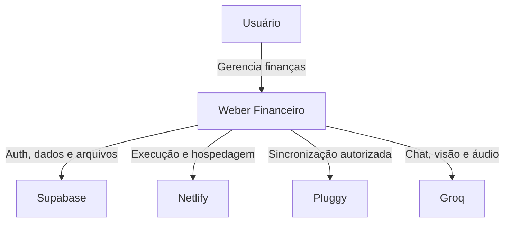
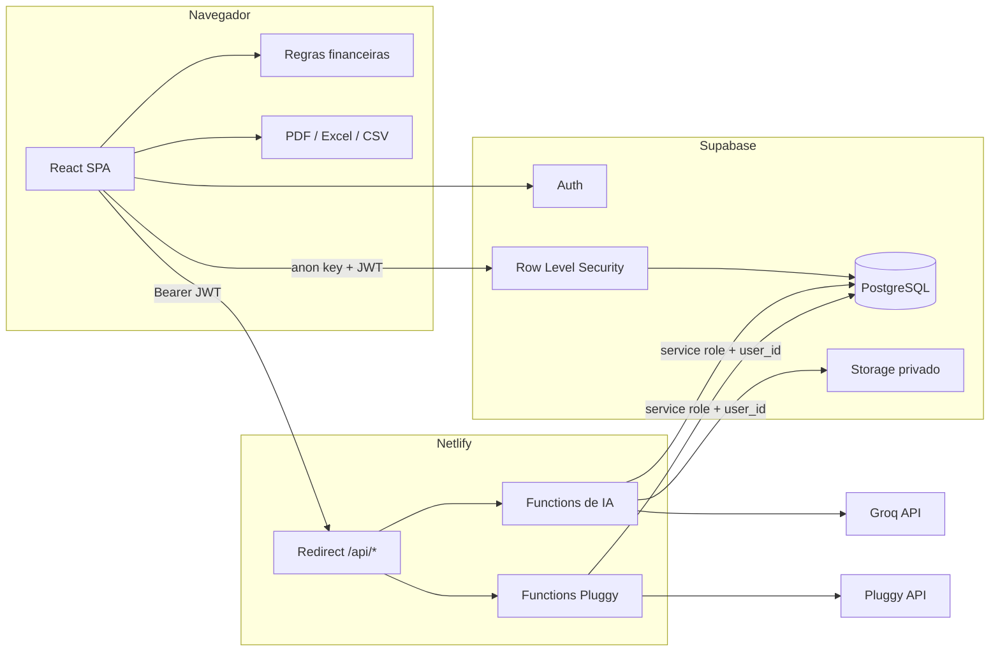
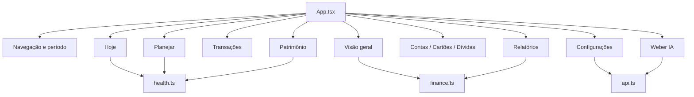
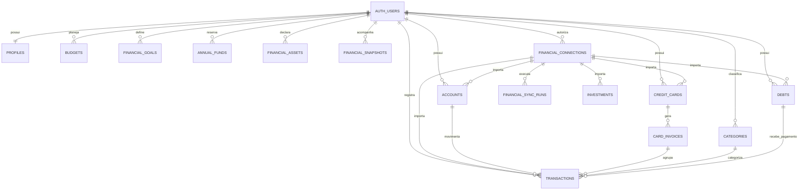

# Arquitetura e system design

## 1. Objetivos

O Weber Financeiro é uma aplicação pessoal de gestão financeira com três objetivos arquiteturais:

1. apresentar uma visão consolidada em poucos segundos;
2. proteger dados e credenciais financeiras;
3. integrar fontes externas sem duplicar ou corromper o histórico manual.

Os requisitos mais importantes são consistência monetária, isolamento por usuário, sincronização idempotente, boa experiência responsiva e baixo custo operacional.

## 2. Contexto do sistema

## 3. Containers

### Responsabilidades

| Componente | Responsabilidade |
| --- | --- |
| React SPA | Interface, sessão, navegação, formulários e visualização |
| Regras financeiras | Saldos, fluxo, faturas, previsões, alertas e saúde financeira |
| Supabase Auth | Identidade e emissão do JWT |
| PostgreSQL | Fonte persistente de verdade |
| RLS | Isolamento de registros por usuário |
| Netlify Functions | Fronteira segura para segredos e integrações |
| Pluggy | Origem externa de dados bancários autorizados |
| Groq | Inferência de texto, visão e áudio |

## 4. Componentes do frontend

`App.tsx` mantém a sessão e o estado financeiro carregado. Os módulos `finance.ts` e `health.ts` concentram funções puras e testáveis. A interface não executa SQL privilegiado nem conhece segredos externos.

## 5. Modelo de dados

### Agregados principais

- **Movimentação:** `transactions`, conta, categoria, cartão, fatura e dívida.
- **Planejamento:** `budgets`, `financial_goals` e `annual_funds`.
- **Patrimônio:** contas, investimentos, ativos, dívidas e snapshots.
- **Integração:** `financial_connections`, dados com IDs externos e `financial_sync_runs`.
- **Governança:** `financial_audit_log`, `ai_requests` e conversas.

### Regras de modelagem

- Valores monetários usam `NUMERIC`, nunca ponto flutuante no banco.
- Competência, vencimento e pagamento são datas distintas.
- `external_id` identifica dados de integração.
- `connection_id` permite limpar somente uma origem.
- Restrições únicas impedem duplicação durante `upsert`.
- Exclusões de usuário usam cascata; referências opcionais usam `set null`.

## 6. Backend e APIs

| Rota | Método | Responsabilidade |
| --- | --- | --- |
| `/api/ai-chat` | POST | Conversa contextual e propostas de ação |
| `/api/ai-health` | POST | Diagnóstico de disponibilidade dos modelos |
| `/api/ai-transaction` | POST | Extração de dados de comprovante |
| `/api/transcribe` | POST | Transcrição de áudio |
| `/api/pluggy-health` | POST | Validação segura das credenciais Pluggy |
| `/api/pluggy-connections` | GET | Lista conexões do usuário |
| `/api/pluggy-connections` | POST | Valida e vincula um Item ID |
| `/api/pluggy-connections` | PATCH | Substitui o Item ID |
| `/api/pluggy-connections` | DELETE | Desconecta ou exclui dados importados |
| `/api/pluggy-sync` | POST | Executa sincronização completa |

Todas as rotas autenticadas recebem `Authorization: Bearer <JWT>`. A Function valida o token no Supabase antes de usar a `service_role`. Mesmo com privilégio administrativo, cada consulta inclui o `user_id` autenticado.

## 7. Decisões arquiteturais

### SPA + Functions

Uma SPA oferece navegação rápida e relatórios locais. Functions mantêm segredos fora do bundle e evitam a manutenção de um servidor dedicado.

### Supabase como fonte de verdade

Autenticação, banco, RLS e Storage ficam no mesmo domínio operacional. Isso reduz complexidade e mantém migrations versionadas.

### Cálculos no frontend

Indicadores derivados são calculados por funções puras a partir dos dados autorizados. Vantagens:

- resposta imediata a filtros;
- testes unitários simples;
- menor custo de backend.

Limite: grandes volumes podem exigir agregações SQL ou materializadas no futuro.

### Sincronização por estado final

A Pluggy é tratada como fonte autoritativa apenas para registros associados à conexão. O processo usa `upsert` para itens atuais e remove itens externos obsoletos. Registros manuais nunca são incluídos nessa limpeza.

### Histórico manual preservado

Desconectar pausa novas sincronizações. Excluir remove apenas registros importados pela conexão. Essa separação evita perda acidental do histórico criado pelo usuário.

## 8. Qualidades do sistema

### Segurança

- RLS por usuário.
- JWT validado em cada Function.
- Segredos somente no servidor.
- Storage privado.
- Auditoria de alterações.
- Confirmação de operações destrutivas.

### Confiabilidade

- Sincronização idempotente.
- Batches de 250 registros.
- Paginação limitada de forma segura.
- Histórico de execuções e último erro.
- Retry de autenticação Pluggy após `401`.
- Testes das regras financeiras e mapeamentos externos.

### Performance

- Telas de saúde e relatórios carregadas com `lazy`.
- Consultas independentes executadas em paralelo.
- Gráficos recebem dados já agregados.
- Sincronização automática somente após janela de seis horas.
- Índices em usuário, datas e IDs externos.

### Responsividade

- Sidebar no desktop.
- Navegação inferior e menu lateral no celular.
- Tabelas convertidas em cartões em telas estreitas.
- Grids adaptativos e seletores compactos.

## 9. Escalabilidade

O desenho atual atende uso pessoal e pequenos grupos. Para expansão comercial:

1. mover agregações históricas para SQL ou views materializadas;
2. executar sincronizações em fila assíncrona;
3. introduzir webhooks Pluggy;
4. adicionar observabilidade centralizada;
5. criar limites por usuário e rate limiting;
6. separar ambientes sandbox, staging e produção;
7. versionar contratos de API;
8. implementar consentimento e políticas formais de retenção.

## 10. Limites e riscos conhecidos

| Risco | Mitigação atual | Evolução recomendada |
| --- | --- | --- |
| Indisponibilidade Pluggy | Histórico local e sincronização manual | Fila, retry exponencial e webhook |
| Grande histórico | Paginação e índices | Agregações server-side |
| Credencial vazada | Variáveis privadas e rotação | Secret manager dedicado |
| Dados bancários inconsistentes | Conciliação de saldo e auditoria | Painel de reconciliação |
| Falha em Function longa | Batches e limite de páginas | Jobs assíncronos |
| Uso em múltiplos dispositivos | Supabase como fonte central | Realtime seletivo |

## 11. Princípios de evolução

- Toda regra monetária relevante deve ter teste.
- Toda integração deve ser idempotente.
- Nenhum segredo pode usar prefixo `VITE_`.
- Toda tabela financeira deve ter RLS.
- Dados importados devem manter origem e conexão.
- Uma nova visualização deve apoiar uma decisão concreta.
- Operações destrutivas devem ser explícitas e reversíveis quando possível.
