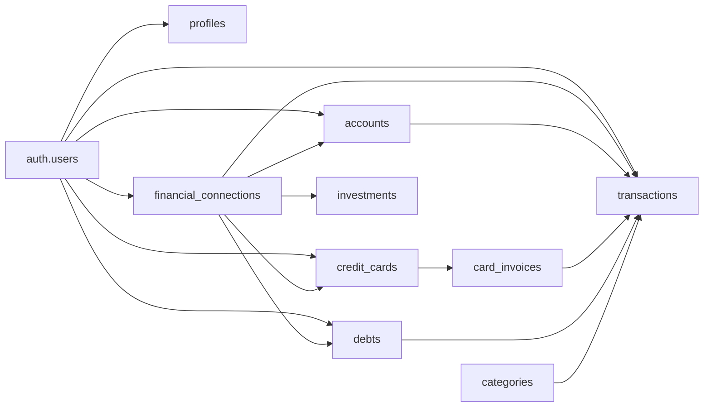

# Banco de dados

## 1. Visão geral

O banco é PostgreSQL gerenciado pelo Supabase. O schema é criado exclusivamente pelas migrations em `supabase/migrations`.

Princípios:

- `auth.users` é a origem de identidade;
- todas as entidades pertencem a um usuário;
- valores monetários usam `NUMERIC`;
- RLS isola registros;
- IDs externos tornam sincronizações idempotentes;
- alterações financeiras relevantes são auditadas.

## 2. Catálogo de tabelas

### Identidade

| Tabela | Finalidade |
| --- | --- |
| `profiles` | Nome, moeda, fuso e preferências financeiras |

Um trigger após criação em `auth.users` cria perfil, categorias padrão e conta principal.

### Operação financeira

| Tabela | Finalidade |
| --- | --- |
| `accounts` | Contas bancárias, poupança e dinheiro |
| `categories` | Categorias de receita/despesa e classes financeiras |
| `credit_cards` | Cartões, limite, fechamento e vencimento |
| `card_invoices` | Faturas por mês de referência |
| `transactions` | Receitas, despesas, transferências, compras e pagamentos |
| `debts` | Dívidas manuais ou empréstimos Pluggy |
| `budgets` | Limite mensal por categoria |
| `installment_groups` | Agrupamento de parcelas |
| `recurring_rules` | Modelo de recorrência |

### Saúde e patrimônio

| Tabela | Finalidade |
| --- | --- |
| `financial_goals` | Metas e reserva de emergência |
| `annual_funds` | Provisões para despesas anuais |
| `financial_assets` | Imóveis, veículos, negócios e outros ativos |
| `financial_snapshots` | Evolução mensal do patrimônio líquido |
| `investments` | Posições importadas da Pluggy |

### Integrações e governança

| Tabela | Finalidade |
| --- | --- |
| `financial_connections` | Item IDs e ciclo de conexão |
| `financial_sync_runs` | Histórico e resultado das sincronizações |
| `financial_audit_log` | Antes/depois de alterações financeiras |
| `attachments` | Metadados dos comprovantes privados |
| `ai_conversations` | Histórico de conversa |
| `ai_requests` | Idempotência das solicitações de IA |

## 3. Transações

### Tipos

| `kind` | Efeito |
| --- | --- |
| `income` | Entrada |
| `expense` | Saída direta |
| `transfer` | Movimento entre contas |
| `card_purchase` | Compra que compõe fatura |
| `invoice_payment` | Saída de caixa da fatura |
| `debt_payment` | Pagamento de dívida |

### Datas

| Campo | Significado |
| --- | --- |
| `competence_date` | Quando o evento econômico ocorreu |
| `due_date` | Quando deve ser pago ou recebido |
| `paid_date` | Quando houve liquidação |

### Estados

- `paid`
- `pending`
- `overdue`
- `cancelled`

### Origem

- `manual`
- `chat`
- `audio`
- `ocr`
- `pluggy`

## 4. Integração externa

Contas, cartões, faturas, transações, dívidas e investimentos importados usam:

| Campo | Finalidade |
| --- | --- |
| `connection_id` | Isola uma conexão |
| `external_provider` | Identifica a origem |
| `external_id` | Chave idempotente externa |
| `imported_at` | Data da importação |
| `reported_balance` | Saldo informado pela origem |
| `reported_balance_at` | Momento do saldo externo |

Índices únicos combinam usuário, provedor e ID externo.

## 5. Relacionamentos críticos



## 6. RLS

O padrão de política é:

```sql
for all
using (user_id = auth.uid())
with check (user_id = auth.uid())
```

`profiles` usa `id = auth.uid()`.

O audit log possui somente política de leitura para o proprietário. Functions com `service_role` ultrapassam RLS, portanto devem repetir o filtro de usuário explicitamente.

## 7. Storage

Bucket: `receipts`.

Características:

- privado;
- limite de tamanho definido na migration;
- MIME types controlados;
- caminho iniciado pelo UUID do usuário;
- políticas separadas para leitura, upload e exclusão.

Formato:

```text
<user-id>/<uuid>.<extensão>
```

## 8. Auditoria

A Function SQL `log_financial_change()` registra mutações em tabelas configuradas pela migration `003`.

Atualizações que alteram somente timestamps técnicos podem ser ignoradas para reduzir ruído.

O log é append-only para o usuário normal.

## 9. Índices

Principais estratégias:

- usuário + vencimento;
- usuário + competência;
- cartão + competência;
- dívidas ativas por usuário;
- conexão + data da execução;
- usuário + status da conexão;
- IDs externos únicos;
- mês de snapshot único por usuário.

Novos índices devem responder a consultas observadas, não apenas antecipadas.

## 10. Migrations

| Arquivo | Responsabilidade |
| --- | --- |
| `202607290001_initial_schema.sql` | Base financeira, RLS, triggers e Storage |
| `202607300001_payment_method.sql` | Método de pagamento |
| `202607300002_pluggy_sync.sql` | Open Finance e investimentos |
| `202607300003_financial_health.sql` | Saúde financeira, patrimônio e auditoria |

Regras:

- execute em ordem;
- não edite uma migration já aplicada em produção;
- crie uma nova migration para correções;
- prefira mudanças aditivas;
- faça backup antes de alterações destrutivas.

## 11. Consultas operacionais

Últimas sincronizações:

```sql
select status, started_at, finished_at, inserted_count, updated_count, error_count
from public.financial_sync_runs
order by started_at desc
limit 20;
```

Conexões com erro:

```sql
select display_name, status, last_synced_at, last_error
from public.financial_connections
where status = 'error';
```

Volume por origem:

```sql
select source, count(*), sum(amount)
from public.transactions
group by source
order by source;
```

Execute consultas administrativas somente em ambiente seguro. Não compartilhe resultados com dados reais.

## 12. Validação pós-migration

- [ ] Tabelas e índices existem.
- [ ] RLS está habilitado.
- [ ] Usuário recebe perfil e dados iniciais.
- [ ] Usuário A não lê dados do usuário B.
- [ ] Comprovante só é acessado pelo proprietário.
- [ ] IDs externos rejeitam duplicidade.
- [ ] Audit log recebe alterações.
- [ ] Aplicação carrega sem erros de coluna ausente.
## 13. Atualização Pluggy: limites e faturas

A migration `202607300004_pluggy_credit_details.sql` adiciona `credit_cards.used_limit` e `credit_cards.metadata`, além dos campos oficiais de faturas em `card_invoices` (`minimum_payment`, `paid_amount`, `payments`, `finance_charges`, `allows_installments` e `currency_code`). A coluna `closing_date` passa a aceitar nulo porque a Pluggy documenta esse campo como opcional.

Execute a migration após `202607300003_financial_health.sql`. A Function de sincronização mantém os filtros por `user_id`, `connection_id` e `external_provider`, faz upsert idempotente por ID externo e limpa apenas faturas que deixaram de ser retornadas para aquela conexão.
