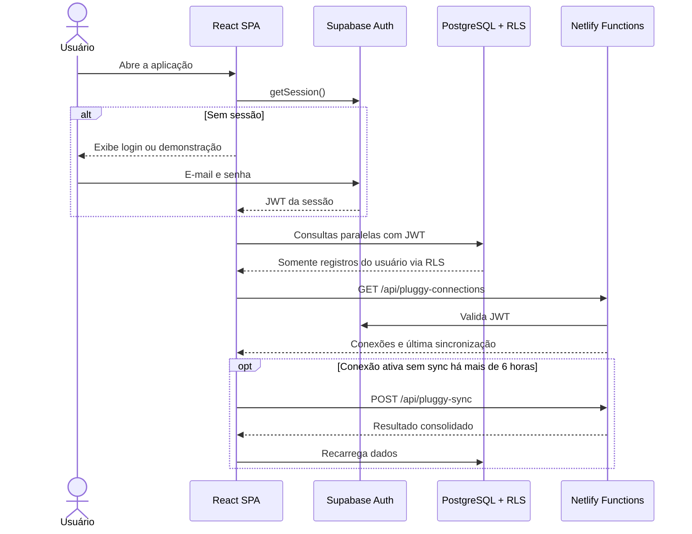
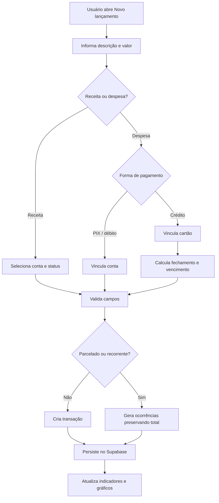
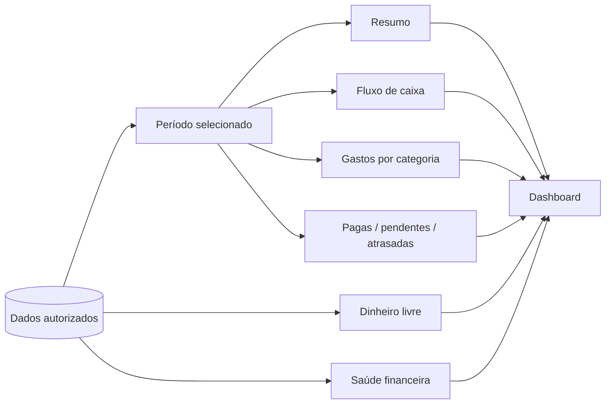
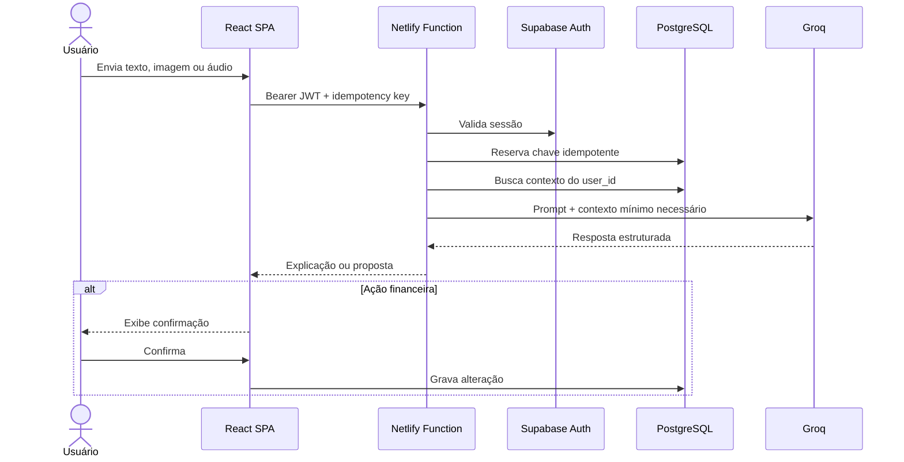
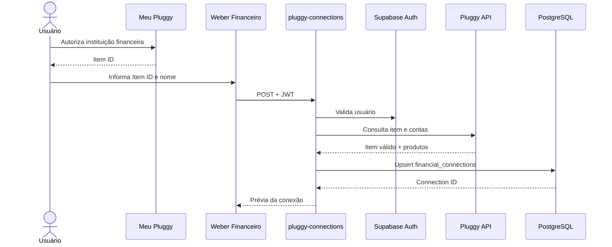
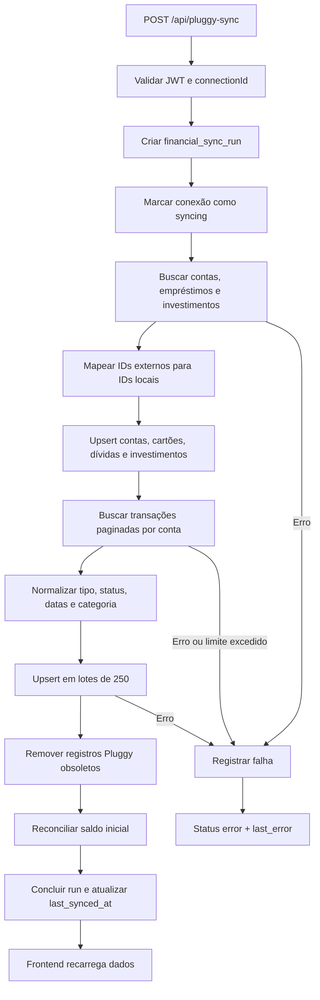
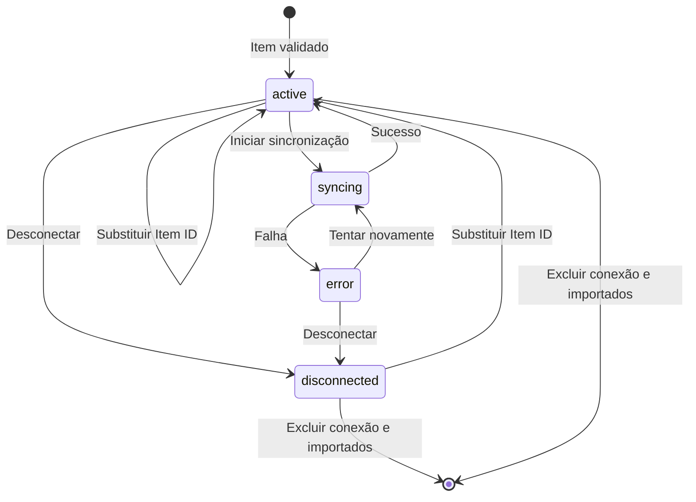
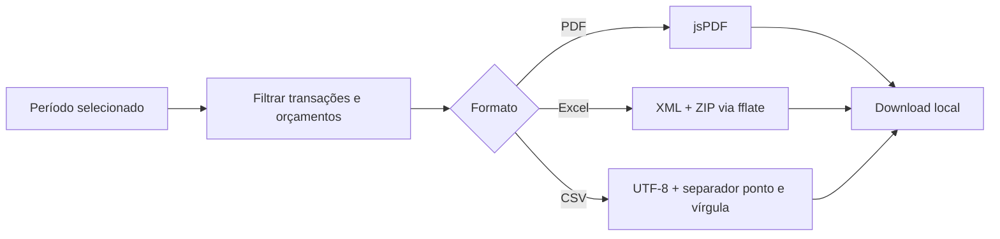
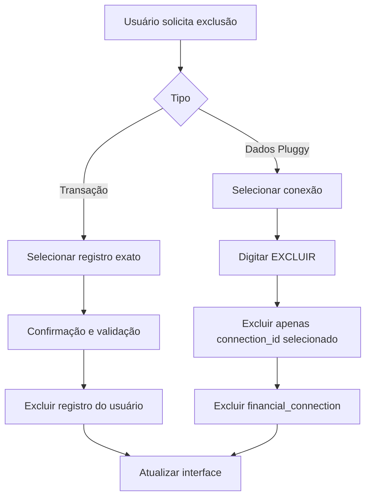

# Fluxos da plataforma

Este documento descreve os principais caminhos funcionais e as fronteiras entre navegador, Supabase, Netlify, Groq e Pluggy.

## 1. Inicialização e autenticação

## 2. Lançamento manual

### Regras críticas

- Compras no cartão usam `card_purchase`.
- Pagamento da fatura usa `invoice_payment`.
- O fluxo de caixa ignora a compra quando a fatura já representa a saída.
- Transferências movimentam duas contas sem virar receita ou despesa.
- Parcelas preservam o valor total mesmo com arredondamento.

## 3. Consulta financeira

O modo **Mês** usa início e fim do mês. O modo **Intervalo** usa datas inclusivas e atravessa meses. Saldo de contas, patrimônio e dívidas representam o estado atual e não são limitados pelo filtro histórico.

## 4. Weber IA

O modelo não recebe acesso a SQL nem credenciais. Alterações propostas retornam ao frontend e passam pelo fluxo normal de confirmação.

## 5. Vínculo Pluggy

O `Item ID` pertence à conexão e fica no banco. `Client ID` e `Client Secret` pertencem ao servidor e ficam nas variáveis de ambiente.

## 6. Sincronização Pluggy

Mais detalhes em [Integração Pluggy](PLUGGY.md).

## 7. Ciclo de vida da conexão

### Efeito de cada ação

| Ação | Conexão | Dados importados | Dados manuais |
| --- | --- | --- | --- |
| Sincronizar | Mantida | Atualizados | Preservados |
| Desconectar | Status `disconnected` | Preservados | Preservados |
| Substituir | Reutilizada com novo Item ID | Antigos removidos | Preservados |
| Excluir dados | Removida | Removidos | Preservados |

## 8. Exportação

Os arquivos são gerados no navegador. Nenhum dado é enviado para um serviço de exportação.

## 9. Exclusão segura

