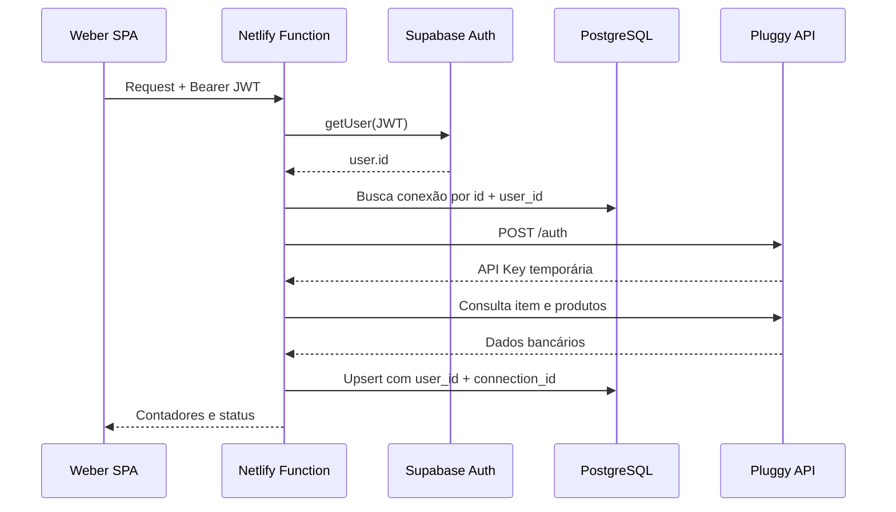

# Integração Pluggy

## 1. Objetivo

A integração importa os dados bancários pessoais já autorizados no Meu Pluggy. No fluxo atual, a instituição é conectada fora do Weber Financeiro e o `Item ID` resultante é vinculado em **Configurações → Open Finance pessoal**.

## 2. Estado

- Backend, banco e interface implementados.
- Sandbox validado.
- Contas, cartões, transações, empréstimos e investimentos suportados.
- Produção depende da liberação da Pluggy e das credenciais correspondentes.

## 3. Credenciais e identificadores

| Valor | Onde fica | Motivo |
| --- | --- | --- |
| `PLUGGY_CLIENT_ID` | `.env`/Netlify | Credencial privada da aplicação |
| `PLUGGY_CLIENT_SECRET` | `.env`/Netlify | Segredo privado da aplicação |
| `PLUGGY_BASE_URL` | `.env`/Netlify | Endpoint configurável |
| `PLUGGY_MODE` | `.env`/Netlify | Marcador interno sandbox/personal |
| `Item ID` | `financial_connections` | Identifica a conexão do usuário |
| `Connection ID` | Banco e frontend | Identifica o vínculo dentro do Weber |

Nunca use prefixo `VITE_` nas credenciais Pluggy. Variáveis `VITE_*` entram no bundle do navegador.

## 4. Configuração

```env
PLUGGY_CLIENT_ID=seu-client-id
PLUGGY_CLIENT_SECRET=seu-client-secret
PLUGGY_BASE_URL=https://api.pluggy.ai
PLUGGY_MODE=sandbox
```

Depois:

1. aplique as migrations `002` e `003`;
2. reinicie `npx netlify dev`;
3. abra Configurações;
4. teste as credenciais;
5. vincule um `Item ID`;
6. execute a sincronização.

O `Item ID` não deve ficar no `.env`, porque pertence a um usuário, pode mudar e pode existir mais de um por conta.

## 5. Comunicação



### Autenticação Pluggy

O cliente server-side troca `Client ID` e `Client Secret` por uma API Key temporária. A chave fica em cache no processo da Function. Se a Pluggy responder `401`, o cache é invalidado e a chamada é repetida uma vez.

## 6. Endpoints internos

### `POST /api/pluggy-health`

Valida se as credenciais conseguem autenticar na Pluggy.

### `GET /api/pluggy-connections`

Lista conexões do usuário, status, produtos, última sincronização e último erro.

### `POST /api/pluggy-connections`

Valida o `Item ID`, consulta uma prévia e cria ou reativa a conexão.

Corpo:

```json
{
  "itemId": "uuid-do-item",
  "displayName": "Banco pessoal"
}
```

### `PATCH /api/pluggy-connections`

Valida o novo item, atualiza a conexão e remove os dados importados do item anterior.

```json
{
  "connectionId": "uuid-da-conexao",
  "itemId": "novo-uuid-do-item",
  "displayName": "Conta pessoal"
}
```

### `DELETE /api/pluggy-connections`

```json
{
  "connectionId": "uuid-da-conexao",
  "mode": "disconnect"
}
```

`disconnect` preserva os dados. `delete` apaga os registros vinculados àquela conexão.

### `POST /api/pluggy-sync`

```json
{
  "connectionId": "uuid-da-conexao"
}
```

Importa e reconcilia todos os produtos suportados.

## 7. Mapeamento

| Pluggy | Weber Financeiro | Observação |
| --- | --- | --- |
| Conta `BANK` | `accounts` | Saldo e instituição |
| Conta `CREDIT` | `credit_cards` | Limite, fechamento e vencimento |
| Transaction | `transactions` | Tipo, status, datas e origem |
| Loan | `debts` | Saldo, parcela, CET e prazo |
| Investment | `investments` | Saldo, quantidade, rentabilidade e vencimento |

Cada registro importado recebe:

- `external_provider = 'pluggy'`;
- `external_id`;
- `connection_id`;
- data de importação;
- metadados quando necessários.

## 8. Idempotência e consistência

### Upsert

IDs externos são reutilizados. Sincronizar novamente atualiza o registro existente, em vez de criar cópia.

### Paginação

As transações são lidas por conta, seguindo o link `next`. O limite defensivo é de 40 páginas, até 20 mil transações conforme o tamanho esperado de página.

### Batches

Gravações usam lotes de 250 registros para reduzir payload e tempo de transação.

### Limpeza

Depois do upsert, IDs externos que existiam localmente e não vieram mais da Pluggy são removidos. A consulta sempre restringe `user_id`, `connection_id` e `external_provider`.

### Conciliação

O saldo inicial local é ajustado para que o saldo calculado a partir das transações corresponda ao saldo reportado pela instituição.

### Cartões

Compras são registradas como `card_purchase`; pagamento de fatura usa `invoice_payment`. Os cálculos evitam contar os dois como despesas independentes.

## 9. Sincronização automática

Ao iniciar uma sessão, a aplicação:

1. carrega os dados locais;
2. lista conexões;
3. identifica conexões ativas sem sincronização nas últimas seis horas;
4. sincroniza uma a uma;
5. recarrega os dados se alguma execução ocorreu.

A sincronização manual continua disponível em Configurações.

## 10. Sandbox para produção

Fluxo recomendado:

1. mantenha a conexão sandbox enquanto valida a aplicação;
2. obtenha a liberação de produção;
3. configure as credenciais de produção na Netlify;
4. conecte as contas reais pelo Meu Pluggy;
5. use **Substituir** na conexão sandbox;
6. sincronize;
7. confira saldos, cartões, dívidas, investimentos e categorias.

Não edite o `Item ID` diretamente no banco. O fluxo de substituição valida o item antes da limpeza.

## 11. Diagnóstico

| Sintoma | Verificação |
| --- | --- |
| Credenciais não configuradas | Confirme variáveis e reinicie Netlify Dev |
| `401` da Pluggy | Revogue/regenere credenciais e teste novamente |
| Item não encontrado | Confirme ambiente e UUID |
| Nenhuma conta retornada | Verifique status do item no dashboard Pluggy |
| Dados duplicados | Confira índices externos e `connection_id` |
| Empréstimos ausentes | Confirme suporte do conector ao produto Loans |
| Investimentos ausentes | Confirme suporte do conector a Investments |
| Sync permanece com erro | Consulte `last_error` e `financial_sync_runs` |
| Saldo divergente | Revise conciliação e transações removidas na origem |

## 12. Segurança

- Credenciais nunca retornam ao frontend.
- Todo endpoint valida o JWT.
- Toda conexão é buscada por `id` e `user_id`.
- Exclusão atua somente sobre o `connection_id` escolhido.
- Mensagens públicas evitam expor detalhes sensíveis.
- O histórico de execução registra sucesso, falha e contadores.

Consulte também [Segurança](SECURITY.md).
