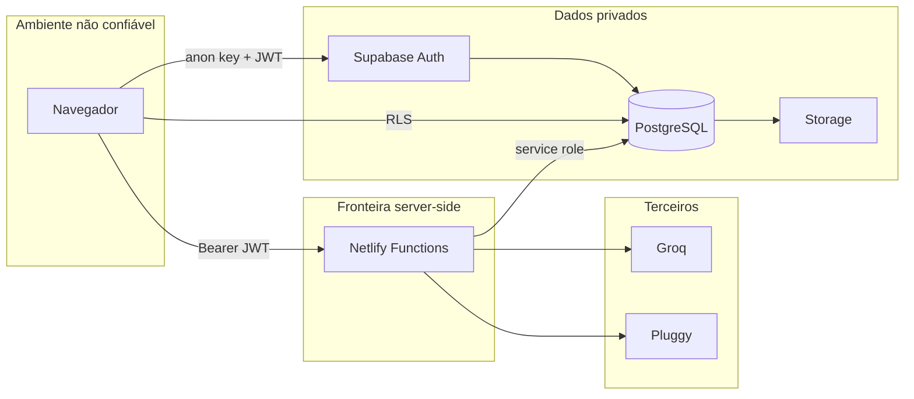

# Segurança

## 1. Escopo

Este documento registra os controles técnicos do Weber Financeiro. O projeto manipula dados financeiros pessoais e deve adotar o princípio de menor privilégio, mesmo sendo de uso pessoal.

## 2. Fronteiras de confiança



O navegador é tratado como ambiente público. Qualquer validação executada apenas nele é uma melhoria de UX, não um controle de segurança.

## 3. Classificação de dados

| Classe | Exemplos | Proteção |
| --- | --- | --- |
| Pública | Logo, textos e assets | Repositório e CDN |
| Interna | Arquitetura e nomes de rotas | Documentação |
| Pessoal | E-mail, preferências e metas | Auth + RLS |
| Financeira sensível | Saldos, transações, dívidas e investimentos | RLS, JWT, auditoria |
| Segredo | Service role, Groq e Pluggy secret | Variável server-side |

## 4. Autenticação e autorização

- Supabase Auth gerencia identidade e sessão.
- O frontend usa JWT para acesso sujeito a RLS.
- Functions extraem o Bearer token e chamam `auth.getUser`.
- Uma Function só continua quando o usuário foi validado.
- Consultas administrativas incluem `user_id = usuário autenticado`.
- Conexões Pluggy incluem também `connection_id`.

### RLS

Todas as tabelas financeiras possuem RLS. Políticas permitem ao usuário operar somente registros em que:

```sql
user_id = auth.uid()
```

Em `profiles`, a chave `id` corresponde ao `auth.uid()`.

## 5. Gestão de segredos

### Permitido no frontend

- `VITE_SUPABASE_URL`
- `VITE_SUPABASE_ANON_KEY`

### Exclusivo do servidor

- `SUPABASE_SERVICE_ROLE_KEY`
- `GROQ_API_KEY`
- `PLUGGY_CLIENT_ID`
- `PLUGGY_CLIENT_SECRET`

Regras:

- nunca usar prefixo `VITE_` em segredo;
- nunca registrar segredos em logs;
- nunca incluir `.env` ou dumps no Git;
- rotacionar imediatamente após suspeita de vazamento;
- usar valores diferentes por ambiente.

## 6. Proteção de APIs

- Métodos HTTP são limitados por rota.
- Payloads externos são validados com Zod.
- Respostas usam `Cache-Control: no-store`.
- Operações não GET recebem `X-Idempotency-Key`.
- Requisições de IA registram a chave em `ai_requests`.
- Erros públicos evitam stack traces e segredos.
- Timeouts e paginação limitam chamadas externas.

## 7. Privacidade na IA

- Apenas contexto necessário é enviado ao modelo.
- O modelo não acessa banco ou SQL diretamente.
- Áudios são processados para transcrição e não persistidos.
- Comprovantes ficam em Storage privado.
- Ações propostas pela IA exigem confirmação no frontend.
- Exclusões exigem seleção inequívoca e nova validação.

## 8. Privacidade na interface

O modo de privacidade desfoca valores financeiros. Esse recurso protege contra observação casual da tela, mas não substitui autenticação, bloqueio do dispositivo ou criptografia.

## 9. Auditoria

Triggers registram `INSERT`, `UPDATE` e `DELETE` em entidades financeiras. O log contém:

- usuário proprietário;
- tabela;
- ID do registro;
- operação;
- estado anterior;
- estado posterior;
- data e hora.

Usuários podem ler seus próprios logs, mas não alterá-los pela política normal.

## 10. Threat model

| Ameaça | Controle atual | Risco residual |
| --- | --- | --- |
| Usuário lê dados de outro usuário | RLS e filtros server-side | Erro em nova tabela sem RLS |
| Roubo de segredo pelo bundle | Segredos somente nas Functions | Configuração incorreta com `VITE_` |
| Repetição de operação | Chave idempotente | Rotas não cobertas por claim |
| Item ID de outro usuário | Busca por conexão e `user_id` | Comprometimento da conta |
| Exclusão excessiva | Confirmação e `connection_id` | Erro de implementação futura |
| Prompt injection | Sem SQL direto e confirmação | Resposta enganosa ao usuário |
| Upload malicioso | MIME e bucket privado | Análise profunda de arquivo limitada |
| Dependência comprometida | Lockfile e builds reproduzíveis | Supply chain do npm |
| Sessão roubada | JWT e expiração Supabase | Dispositivo comprometido |

## 11. Checklist para novas funcionalidades

- [ ] A tabela possui `user_id`.
- [ ] RLS foi habilitado.
- [ ] Política foi testada com dois usuários.
- [ ] Inputs são validados no servidor.
- [ ] Segredos ficam fora do frontend.
- [ ] Logs não contêm dados sensíveis desnecessários.
- [ ] Operações repetidas são idempotentes.
- [ ] Exclusão é limitada ao recurso autorizado.
- [ ] Regra financeira possui teste.
- [ ] Migration é aditiva e revisável.
- [ ] Documentação foi atualizada.

## 12. Resposta a incidente

1. contenha o acesso: revogue chave ou sessão;
2. preserve logs relevantes;
3. identifique período, usuários e dados afetados;
4. rotacione credenciais;
5. corrija a causa;
6. valide RLS e integrações;
7. restaure dados se necessário;
8. documente o incidente e a prevenção.

Consulte [Operação e deploy](OPERATIONS.md#incidente-com-credenciais) para o procedimento operacional.

## 13. Divulgação responsável

Não publique em issues:

- credenciais;
- `Item ID` real;
- extratos;
- comprovantes;
- e-mails de usuários;
- dumps ou logs completos.

Relatos devem conter passos mínimos para reprodução usando dados fictícios.
